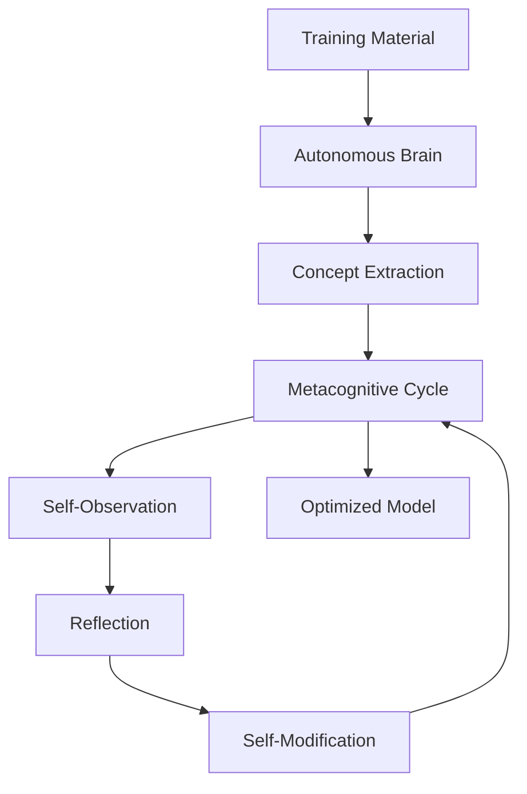

<div align="center">

# 🧠 Metacognitive System for AI Models

**Accelerated, Self-Optimizing Training for Language Models**

[](https://www.python.org/downloads/)
[](https://pytorch.org/)
[](LICENSE)

</div>

## 🔍 Overview

This project aims to build a **metacognitive system that allows AI models to observe, analyze, and adjust their own learning processes**. Through a cycle of introspection and modification, models can evolve autonomously during training.

Initial tests have yielded **functional models**, even though they're not yet optimal. Notably, the entire process runs on **low-cost hardware (GTX 1650 + 16 GB RAM)** with **surprisingly fast training times**.

## 🧠 Purpose: Real Acceleration & Self-Improvement

The goal is not just faster training, but to enable **models that understand and improve themselves**. This includes:

* Introspective reasoning
* Parameter self-adjustment
* Real-time performance analysis during training

## 🛠️ General Architecture



## ⚙️ Code Structure

| File / Module                 | Function                                     |
| ----------------------------- | -------------------------------------------- |
| `autonomous_brain.py`         | Automatically extracts concepts              |
| `self_observation.py`         | Observes weights, gradients, and activations |
| `metacognitive_reflection.py` | Reflects on the model's state                |
| `self_modification.py`        | Adjusts the model autonomously               |
| `metacognitive_training.py`   | Trains models with introspection             |
| `train.py`                    | General training script                      |

## 📈 Early Results

* ✔️ Functional models already working
* 🖥️ Trained on low-cost hardware (GTX 1650, 16 GB RAM)
* ⚡ Training completed in record times
* 🔧 Models are not yet optimal, but improve as they train

## 🔄 Metacognitive Cycle

| Stage            | Purpose                                      |
| ---------------- | -------------------------------------------- |
| **Observation**  | Analyze internal model state                 |
| **Reflection**   | Generate hypotheses and learning insights    |
| **Modification** | Change parameters, architecture, or behavior |
| **Repetition**   | Cycle repeats throughout training            |

## 📦 Installation

```bash
git clone (soon)
cd metacognitive-system
pip install -r requirements.txt
```

## 🚀 Training Example

```bash
python Scripts/training/train_with_metacognitive.py \
    --base_model new \
    --work_dir ./training_data \
    --external_dataset ./data/texts \
    --intelligence_level 10 \
    --cycles 25 \
    --steps 1000 \
    --use_autonomous_brain \
    --batch_size 4 \
    --learning_rate 5e-5 \
    --fp16
```

## 💡 Next Steps

* Refine reflection and self-adjustment mechanisms
* Improve model awareness of overfitting
* Integrate deeper attention and activation analysis

## 📄 License

```
Apache 2.0 License
```

<div align="center">

## 🧠 Contact

**Developed by:** NeuroForge Labs
📧 Email: [neuroforgelabs@proton.me](mailto:neuroforgelabs@proton.me)
🤝 Discord: [Join us](https://discord.gg/w9RsadnAsW)

</div>

