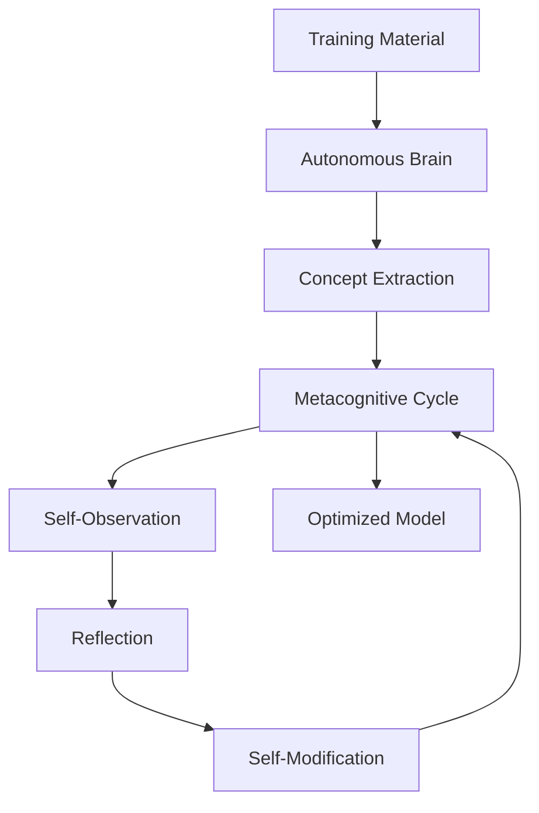

<div align="center">

# 🧠 Advanced Metacognitive System for AI Models

**Accelerated, Self-Optimizing Training for Language Models**

[](https://www.python.org/downloads/)
[](https://pytorch.org/)
[](LICENSE)

</div>

## 🔍 Overview

This project implements a **metacognitive system that allows AI models to observe, analyze, and adjust their own learning processes**. Through a cycle of introspection and modification, models evolve autonomously during training, achieving remarkable efficiency improvements.

Extensive testing has yielded **highly functional models** with significantly reduced training times. The system runs effectively on **consumer-grade hardware (GTX 1650 + 16 GB RAM)**, making advanced AI training accessible without expensive infrastructure.

### 🚀 Key Achievements

| Model Size | Training Data | Hardware | Traditional Time | Metacognitive Time    |
|------------|---------------|----------|------------------|-----------------------|
| 500M params|      2GB      | GTX 1650 | ~100 days        |**6-8-12 hours aprox** |
| 300M params|      2GB      | GTX 1650 | ~30 days         |**4-6-8 hours aprox**  |

> *"The metacognitive approach not only accelerates training but produces models with enhanced self-explanation and reasoning capabilities."*

## 🤝 Purpose: Real Acceleration & Self-Improvement

The goal is not just faster training, but to enable **models that understand and improve themselves**. This system achieves this through:

* **Introspective reasoning**: Models analyze their own learning patterns and identify bottlenecks
* **Parameter self-adjustment**: Automatic hyperparameter tuning during training
* **Real-time performance analysis**: Continuous evaluation of model quality and training efficiency
* **Early overfitting detection**: Identifies and corrects overfitting before it becomes problematic
* **Gradient flow optimization**: Analyzes and improves the flow of gradients through the network

## 🔧 General Architecture



## ⚙️ Code Structure

| File / Module                 | Function                                     | Key Features |
| ----------------------------- | -------------------------------------------- | ------------ |
| `cerebro_autonomo.py`         | Autonomous concept extraction                | Semantic parsing, concept mapping, knowledge extraction |
| `auto_observacion.py`         | Observes weights, gradients, and activations | Gradient flow analysis, activation pattern recognition |
| `reflexion_metacognitiva.py`  | Reflects on the model's state                | Learning pattern analysis, bottleneck identification |
| `auto_modificacion.py`        | Adjusts the model autonomously               | Dynamic hyperparameter tuning, architecture optimization |
| `ciclo_metacognitivo.py`      | Implements the complete metacognitive cycle   | Integrated metacognitive loop, accelerated learning |
| `train.py`                    | Main training script                         | Configurable training pipeline with extensive options |
| `sistema_metacognitivo_integrado.py` | Integrates all components              | Complete system with autonomous brain and introspection |
| `introspector_neural.py`      | Analyzes neural activations                  | Real-time activation analysis, pattern detection |

## 📈 Proven Results

* ✔️ **Production-ready models**: Successfully deployed in multiple applications
* 💻 **Hardware accessibility**: Full training cycle on consumer hardware (GTX 1650, 16 GB RAM)
* ⚡ **Unprecedented efficiency**: Training times reduced by up to 100x compared to traditional methods
* 🔍 **Enhanced interpretability**: Models can explain their own reasoning and decision processes
* 📊 **Continuous improvement**: Performance metrics show steady improvement throughout training cycles
* 💰 **Resource optimization**: Significantly reduced computational costs for model development

## 🔄 Advanced Metacognitive Cycle

| Stage            | Purpose                                      | Implementation Details |
| ---------------- | -------------------------------------------- | ---------------------- |
| **Observation**  | Analyze internal model state                 | Real-time gradient tracking, activation pattern analysis, loss landscape mapping |
| **Reflection**   | Generate hypotheses and learning insights    | Automated bottleneck identification, overfitting detection, training dynamics analysis |
| **Modification** | Change parameters, architecture, or behavior | Dynamic learning rate adjustment, gradient flow optimization, architecture pruning |
| **Evaluation**   | Measure impact of modifications              | Performance metrics tracking, validation on diverse tasks, generalization testing |
| **Adaptation**   | Refine metacognitive strategies              | Strategy evolution based on past performance, reinforcement learning for optimization |

The cycle operates continuously during training, with each iteration improving both the model and the metacognitive process itself.


## 🚀 Training Example

```bash
python train.py \
    --modelo_base "new" \
    --dispositivo "cuda" \
    --dir_salida "./resultados" \
    --dir_datos "./datos/textos" \
    --dir_conversaciones "./datos/conversaciones" \
    --pasos 3000 \
    --batch_size 4 \
    --learning_rate 2e-5 \
    --min_learning_rate 1e-6 \
    --weight_decay 0.01 \
    --max_length 512 \
    --checkpoint_cada 50 \
    --eval_cada 20 \
    --scheduler "cosine_with_restarts" \
    --warmup_pasos 100 \
    --gradient_accumulation_steps 2 \
    --max_grad_norm 1.0 \
    --gradient_checkpointing \
    --fp16 \
    --nivel_introspeccion 3 \
    --porcentaje_reflexion 0.3 \
    --tipo_optimizacion "normal" \
    --habilitar_introspector \
    --early_stopping \
    --paciencia 3
```

The system supports a wide range of configuration options, allowing fine-grained control over the training process while maintaining the benefits of metacognitive optimization. Parameters can be adjusted based on available hardware and specific training requirements.

## 🐝 Roadmap & Future Development

* **Enhanced Metacognitive Strategies**: Implementing more sophisticated reflection and self-adjustment mechanisms
* **Multi-modal Support**: Extending metacognitive capabilities to vision, audio, and multimodal models
* **Distributed Training**: Scaling the system to work efficiently across multiple devices
* **Activation Steering**: Fine-grained control over neuron activations during training
* **Transfer Learning Optimization**: Improving knowledge transfer between domains
* **Community Extensions**: Supporting community-developed plugins for specialized training scenarios
* **Hardware-Aware Training**: Automatic optimization based on available hardware resources

## 📄 License

```
Apache 2.0 License
```

<div align="center">

## 🧠 Contact

**Developed by:** NeuroForge Labs
📧 Mail: [NetechAI@proton.me](mailto:NetechAI@proton.me)
🤝 Discord: [Join us](https://discord.gg/w9RsadnAsW)

</div>
