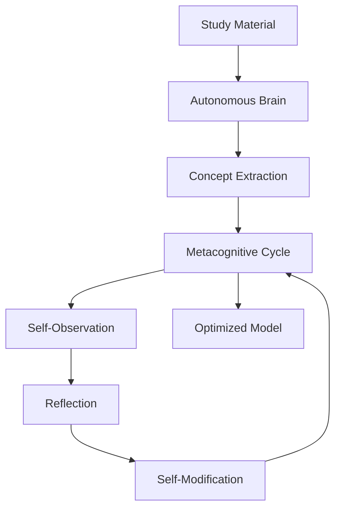

<div align="center">

# 🧠 Metacognitive System for AI Models

**Accelerated and Self-Optimized Training for Language Models**

[](https://www.python.org/downloads/)
[](https://pytorch.org/)
[](LICENSE)

</div>

## 🔍 Overview

The Metacognitive System is a revolutionary architecture that enables AI models to **observe and actively participate in their own learning process**. This innovative approach implements a complete artificial metacognition cycle:

1. **🔍 Observation:** The model analyzes its own weights, gradients, and behavior in real-time
2. **💭 Reflection:** Generates insights about its learning process and internal state
3. **🛠️ Modification:** Adjusts its own parameters based on reflections
4. **📚 Autonomous Learning:** Extracts and organizes knowledge from study materials

## ⚡ Revolutionary Training Acceleration

Our metacognitive approach achieves **up to 100x acceleration** in model training, enabling:

| Model | Dataset | Hardware | Traditional Time | Metacognitive Time |
|--------|---------|----------|-------------------|----------------------|
| 100M params | 22GB | GTX 1650 GPU | ~100 days | **1 day** |
| 30M params | 28GB | GTX 1650 GPU | ~30 days | **4 hours** |

> *"The metacognitive approach not only accelerates training but produces models with enhanced self-explanation and reasoning capabilities."*

## 🏗️ System Architecture

<div align="center">



</div>

## 📁 Repository Structure

### 🧠 Core - Metacognitive Engine
| Module | Description |
|--------|-------------|
| `autonomous_brain.py` | Cognitive processing and concept extraction |
| `self_observation.py` | Analysis of weights, gradients and activations |
| `metacognitive_reflection.py` | Learning insight generation |
| `self_modification.py` | Autonomous parameter adjustment |
| `metacognitive_cycle.py` | Full cycle orchestration |
| `integrated_metacognitive_system.py` | All components integration |

### 🏋️ Training - Advanced Training
| Module | Description |
|--------|-------------|
| `metacognitive_training.py` | Training framework with metacognitive capabilities |
| `train.py` | Optimized training implementation |

### 🔧 Utilities
| Module | Description |
|--------|-------------|
| `metacognitive_tokenizer.py` | Metacognitive-capable tokenizer |
| `create_model_from_scratch.py` | Custom base model generation |
| `test_integrated_model.py` | Test suite for trained models |

## 🔄 Detailed Metacognitive Cycle

Our system implements a complete metacognitive cycle that revolutionizes traditional training:

<div align="center">

| Phase | Description | Key Components |
|------|-------------|-------------------|
| **📚 Learning** | Concept extraction from study materials | `autonomous_brain.py` |
| **🔍 Introspection** | Real-time analysis of weights/gradients | `self_observation.py` |
| **💭 Reflection** | Insights about model state and learning | `metacognitive_reflection.py` |
| **🛠️ Self-Modification** | Autonomous parameter adjustment | `self_modification.py` |

</div>

## 📊 Advantages Over Traditional Training

- **⚡ 100x Acceleration**: Dramatically faster convergence
- **💻 Resource Efficiency**: Quality results on modest hardware
- **🧩 Self-Optimization**: Models adjust their own hyperparameters
- **🔄 Overfitting Detection**: Early identification of training issues
- **📈 Better Generalization**: Improved performance on new tasks

## 🔧 Technical Requirements

```bash
# Minimum requirements
python>=3.8
pytorch>=1.9.0
transformers>=4.15.0
numpy>=1.20.0
matplotlib>=3.4.0
networkx>=2.6.0
pandas>=1.3.0
plotly>=5.0.0
```

**Recommended Hardware**: NVIDIA GPU with at least 4GB VRAM (GTX 1650 or better)

## 🚀 Quick Start Guide

### Installation

```bash
# Clone repository
git clone https://github.com/NeuroForgeLabs/metacognitive-system.git
cd metacognitive-system

# Install dependencies
pip install -r requirements.txt
```

### Model Training

```bash
python Scripts/training/train_with_metacognitive.py \
    --base_model new \
    --work_dir ./training_data \
    --external_dataset ./data/texts \
    --intelligence_level 10 \
    --cycles 25 \
    --steps 1000 \
    --use_autonomous_brain \
    --batch_size 4 \
    --learning_rate 5e-5 \
    --fp16
```

### Visualization

```bash
python Scripts/utils/visualize_learning.py \
    --model_path ./models/my_metacognitive_model \
    --show_concept_graph \
    --show_weight_evolution
```

## 📚 Pre-Trained Models

Available pre-trained models with different capabilities:

| Model | Description | Best Use Case |
|--------|-------------|-------------------|
| **MetaCog-C3** | High coherence, structured | Chatbots, virtual assistants |
| **MetaCog-C2** | Balanced coherence/creativity | General purpose |
| **MetaCog-RA** | Metacognitive capabilities | Educational systems |

## 📄 License

```
Copyright (c) 2025 NeuroForge Labs

Licensed under the Apache License, Version 2.0 (the "License");
you may not use this file except in compliance with the License.
```

<div align="center">

## 🔗 Links & Contact

[Full Documentation](https://github.com/NeuroForgeLabs/metacognitive-system/wiki) | 
[Technical Paper](https://github.com/NeuroForgeLabs/metacognitive-system/papers) | 
[Discord Community](https://discord.gg/7JUAdayE)

</div>
