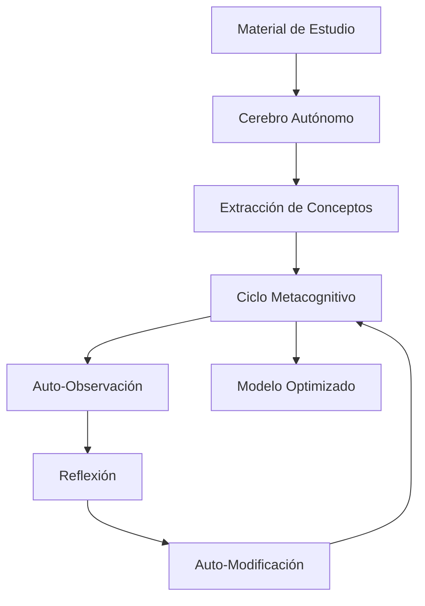

<div align="center">

# 🧠 Sistema Metacognitivo para Modelos de IA

**Entrenamiento acelerado y auto-optimizado para modelos de lenguaje**

[](https://www.python.org/downloads/)
[](https://pytorch.org/)
[](LICENSE)

</div>

## 🔍 Descripción General

El Sistema Metacognitivo es una arquitectura revolucionaria que permite a los modelos de IA **observar y participar activamente en su propio proceso de aprendizaje**. Este enfoque innovador implementa un ciclo completo de metacognición artificial:

1. **🔍 Observación:** El modelo analiza sus propios pesos, gradientes y comportamiento en tiempo real
2. **💭 Reflexión:** Genera insights sobre su proceso de aprendizaje y estado interno
3. **🛠️ Modificación:** Ajusta sus propios parámetros basándose en sus reflexiones
4. **📚 Aprendizaje Autónomo:** Extrae y organiza conocimiento de materiales de estudio

## ⚡ Aceleración Revolucionaria del Entrenamiento

Nuestro enfoque metacognitivo logra una **aceleración de hasta 100x** en el entrenamiento de modelos, permitiendo:

| Modelo | Dataset | Hardware | Tiempo Tradicional | Tiempo Metacognitivo |
|--------|---------|----------|-------------------|----------------------|
| 100M parámetros | 22GB | GPU GTX 1650 | ~100 días | **1 día** |
| 30M parámetros | 28GB | GPU GTX 1650 | ~30 días | **4 horas** |

> *"El enfoque metacognitivo no solo acelera el entrenamiento, sino que produce modelos con capacidades de auto-explicación y razonamiento mejoradas."*

## 🏗️ Arquitectura del Sistema

<div align="center">



</div>

## 📁 Estructura del Repositorio

### 🧠 Core - Núcleo Metacognitivo
| Módulo | Descripción |
|--------|-------------|
| `cerebro_autonomo.py` | Procesamiento cognitivo y extracción de conceptos |
| `auto_observacion.py` | Análisis de pesos, gradientes y activaciones internas |
| `reflexion_metacognitiva.py` | Generación de insights sobre el aprendizaje |
| `auto_modificacion.py` | Modificación autónoma de parámetros |
| `ciclo_metacognitivo.py` | Orquestación del ciclo completo de metacognición |
| `sistema_metacognitivo_integrado.py` | Integración de todos los componentes |

### 🏋️ Training - Entrenamiento Avanzado
| Módulo | Descripción |
|--------|-------------|
| `entrenamiento_metacognitivo.py` | Framework de entrenamiento con capacidades metacognitivas |
| `train.py` | Implementación optimizada para entrenamiento rápido |

### 🔧 Utilidades y Herramientas
| Módulo | Descripción |
|--------|-------------|
| `tokenizador_metacognitivo.py` | Tokenizador con capacidades metacognitivas |
| `crear_modelo_desde_cero.py` | Generación de modelos base personalizados |
| `probar_modelo_integrado.py` | Suite de pruebas para modelos entrenados |

## 🔄 Ciclo Metacognitivo Detallado

Nuestro sistema implementa un ciclo metacognitivo completo que revoluciona el entrenamiento tradicional:

<div align="center">

| Fase | Descripción | Componentes Clave |
|------|-------------|-------------------|
| **📚 Aprendizaje** | Extracción de conceptos y relaciones de materiales de estudio | `cerebro_autonomo.py` |
| **🔍 Introspección** | Análisis en tiempo real de pesos, gradientes y activaciones | `auto_observacion.py` |
| **💭 Reflexión** | Generación de insights sobre el estado del modelo y su aprendizaje | `reflexion_metacognitiva.py` |
| **🛠️ Auto-modificación** | Ajuste autónomo de parámetros basado en las reflexiones | `auto_modificacion.py` |

</div>

## 📊 Ventajas Sobre Entrenamiento Tradicional

- **⚡ Aceleración 100x**: Convergencia dramáticamente más rápida
- **💻 Eficiencia de recursos**: Resultados de calidad en hardware modesto
- **🧩 Auto-optimización**: El modelo ajusta sus propios hiperparámetros
- **🔄 Detección de sobreajuste**: Identificación temprana de problemas de entrenamiento
- **📈 Mejor generalización**: Modelos con mejor desempeño en tareas nuevas

## 🔧 Requisitos Técnicos

```bash
# Requisitos mínimos
python>=3.8
pytorch>=1.9.0
transformers>=4.15.0
numpy>=1.20.0
matplotlib>=3.4.0
networkx>=2.6.0
pandas>=1.3.0
plotly>=5.0.0
```

**Hardware recomendado**: GPU NVIDIA con al menos 4GB VRAM (GTX 1650 o superior)

## 🚀 Guía de Inicio Rápido

### Instalación

```bash
# Clonar el repositorio
git clone https://github.com/NeuroForgeLabs/sistema-metacognitivo.git
cd sistema-metacognitivo

# Instalar dependencias
pip install -r requirements.txt
```

### Entrenamiento de un Modelo

```bash
python Scripts/training/entrenar_con_metacognitivo_directo.py \
    --modelo_base nuevo \
    --dir_trabajo ./datos_entrenamiento \
    --dataset_externo ./datos/textos \
    --nivel_inteligencia 10 \
    --ciclos 25 \
    --pasos 1000 \
    --usar_cerebro_autonomo \
    --batch_size 4 \
    --learning_rate 5e-5 \
    --fp16
```

### Visualización del Proceso Metacognitivo

```bash
python Scripts/utils/visualizar_aprendizaje.py \
    --ruta_modelo ./modelos/mi_modelo_metacognitivo \
    --mostrar_grafo_conceptos \
    --mostrar_evolucion_pesos
```

## 📚 Modelos Pre-entrenados

Ofrecemos varios modelos pre-entrenados con diferentes capacidades:

| Modelo | Descripción | Mejor Caso de Uso |
|--------|-------------|-------------------|
| **MetaCog-C3** | Alta coherencia, estructurado | Chatbots, asistentes virtuales |
| **MetaCog-C2** | Equilibrio coherencia/creatividad | Uso general, versatilidad |
| **MetaCog-RA** | Capacidades metacognitivas | Sistemas educativos, auto-explicación |

## 📄 Licencia

```
Copyright (c) 2025 NeuroForge Labs

Licensed under the Apache License, Version 2.0 (the "License");
you may not use this file except in compliance with the License.
```

<div align="center">

## 🔗 Enlaces y Contacto

[Documentación Completa](https://github.com/NeuroForgeLabs/sistema-metacognitivo/wiki) | 
[Reporte Técnico](https://github.com/NeuroForgeLabs/sistema-metacognitivo/papers) | 
[Comunidad Discord](https://discord.gg/7JUAdayE)

</div>
